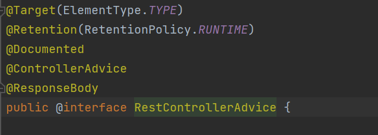

# prepreproject
## 커피 주문 애플리케이션 만들기
### date : 11.21(Mon) ~ 12.11(Sun) </br> </br> 학습 목표 : 복습 및 코드 작성에 익숙해지기


### 11월 21일

- Entity 클래스 구현
- Controller 1차 구현
  - @RestController : Rest API
  - @RequestMapping : URI 작성
  - @RequestBody : Web Request(Json 타입)임을 알려준다.
  - @PathVariable : 해당 메서드의 Path 값
  - @RequestParam : Request URI의 파라미터 값
- Dto 1차 구현
  -  유효성 검증
  - @Validated(클래스레벨) - @Valid(메서드레벨)
  - @Pattern : regexp 애트리뷰트(정규표현식)
  
***

### 11월 22일 
- 클래스 내부에 선언한 enum을 불러올 때의 타입은 해당 enum이 위치한 클래스의 enum명으로 작성 
  - ex. Member 클래스에 작성된 enum MemberStatus는 Dto 클래스에서 밑 코드처럼 표현

    `private Member.MemberStatus memberStatus; `

- `SingleResponseDto`와 `MultiResponseDto` 를 구현하여, Response body를 List로 반환하도록 하였다.
- Service 클래스 가구현
  - @Service : Spring Bean으로 등록을 위한 애너테이션 
  - 실질적인 애플리케이션의 비즈니스 로직을 구현하는 클래스.
- Mapper 인터페이스 구현 
  - Dto를 Entity 객체로, Entity 객체를 ResponseDto로 변환해주는 역할을 한다.
  - MapStruct 의존성 라이브러리 추가 후 빌드 시 자동으로 로직 구현
  - @Mapper + componentModel 애트리뷰트 : 해당 애트리뷰트에 **"spring"** 작성 시, spring Bean으로 등록됨

- Controller 클래스에 Service와 Mapper 클래스 DI -> 추가 구현 필요!

- 의존 라이브리러 추가
  - 유효성 검증 : `'org.springframework.boot:spring-boot-starter-validation'`
  - Mapstruct : `'org.mapstruct:mapstruct:1.4.2.Final'`, `'org.mapstruct:mapstruct-processor:1.4.2.Final'`

***

### 11월 23일
- API 계층 - Service 계층 연동 
- 목록 조회 Mapper 구현 및 응답 데이터 반환 여부 확인 
- 1차 테스팅 완료
- Service 클래스 1차 비즈니스 로직 구현(데이터 액세스 계층 연동 필요)
- ⭐ 데이터 액세스 계층 구현 전, 미리 JPA 의존 라이브러리 연동 시, 에러 발생! 주의할 것
```
    Failed to configure a DataSource: 
        'url' attribute is not specified and no embedded datasource could be configured.

        Reason: Failed to determine a suitable driver class
```
데이터 액세스 계층에 대한 의존 라이브러리를 추가했음에도 데이터 액세스 계층에 대한 정보(연결)를 스프링에 등록하지 않아 발생한 에러
  - 해결 방안 1 : 애초에 의존 라이브러리 추가 X 
  - 해결 방안 2 : 데이터베이스 설정 정보 연동을 위해, H2와 같은 DB 설정(의존 라이브러리)을 추가한다.
  - 해결 방안 3 : 엔트리 포인트 클래스에 추가되어 있는 애너테이션 @SpringBootApplication 애트리뷰트를 추가하는 방법! </br>
`exclude = DataSourceAutoConfiguration.class`
</br> exclude 애트리뷰트는 입력한 클래스를 자동 설정에서 제외시킨다. `DataSourceAutoConfiguration.class`는 데이터베이스에 대한 자동 구성을 담당하는 클래스로 해당 클래스를
제외하면 데이터베이스 연결에 대한 에러가 발생하지 않는다. -> 추후 DB를 비활성화하고 테스팅하기에 유용한 방법! 
  </br> <a href = "https://www.baeldung.com/spring-data-disable-auto-config"> 참고 블로그 </a>
***

### 11월 24일
- Exception Controller Advice 클래스 가구현
  - @RestControllerAdvice : `@ResponseBody`를 가지고 있어 객체를 자동으로 Json 타입으로 변환해준다.
  
  - @ExceptionHandler : 예외 처리 메서드에 추가한다. 
- Error 정보를 반환할 ErrorResponse 클래스 가구현
  - 필요한 정보만 클라이언트에게 보여줄 수 있도록 별도의 클래스를 생성해 반환한다.

***

### 11월 25일
- Exception Handler class 구현
  - @ResponseStatus : HTTP Code를 반환해준다. 
- ErrorResponse 클래스 구현으로 핸들러 메서드와 반환 값을 구하는 메서드를 분리하였다.
- 비즈니스 계층 예외 처리 구현
  - 사용자 정의 예외 : enum 타입의 ExceptionCode를 작성해 구체적인 표현을 할 수 있도록 한다.
  - BusinessLogicException 구현 -> RuntimeException을 상속 받고 있다.

추후 발생하는 Exception에 대한 처리를 바로바로 진행할 것!! 

***

### 11월 26일 
- 목록 조회를 위해 `PageResponse` 클래스 가구현
  - 데이터 액세스 계층 구현 후 로직 작성 예정
- Repository 인터페이스 가구현(`JpaRepository` 상속)
- 페이지네이션 로직 구현 
  - `PageInfo` 클래스로 response 객체 생성
  - Repository에서 목록을 찾기 위해 `Pageable` 생성
  - `Pageable`은 해당 엔티티클래스의 Id 순으로 정렬하도록 Sort 설정 추가
  - Repository로부터 반환된 `Page<Object>`로 부터 `PageInfo`와 `Object` 객체 생성
- 데이터 액세스 계층과의 연동 필요!

***

### 11월 28일
- JPA 기반 데이터 액세스 계층 구현
- 엔티티 클래스 매핑, 애너테이션 추가
  - @Entity : (⭐필수)엔티티 클래스를 지정하는 애너테이션, 애트리뷰트 'name'으로 클래스명과 다르게 이름을 지정할 수 있다.
  - @Table : (선택적 추가) 테이블 명과 엔티티 식별명을 다르게 하고 싶을 경우 사용한다.
    - @Entity만 애트리뷰트 `name` 적용되어있을 경우, 테이블 명도 동일하게 적용된다.
  - @Id : (⭐필수)@Entity와 짝꿍인 애너테이션. 기본키가 될 필드 변수에 추가해준다. 
  - @GenerateValue : 기본 키 값에 대한 생성 전략을 지정하는 애너테이션(`strategy` 애트리뷰트를 통해 자동 생성 전략 지정 )
    - 해당 애너테이션이 없을 경우에는 직접 기본키를 할당하는 것이 디폴트로 적용되어 있다.
    - ⭐IDENTITY : 식별자가 비어 있는 상태에서 INSERT문을 실행하고 테이블에 저장될 때 생성된 식별자를 채우는 방식
    - ⭐SEQUENCE : 테이블에 데이터를 INSERT하기 전에 시퀀스로부터 미리 식별자를 얻어 채워 넣는 방식
    - TABLE : 별도의 키에 대한 테이블을 생성해 사용하는 전략(잘 안씀!)
    - AUTO : JPA가 데이터베이스의 적절한 전략을 자동으로 선택해주는 방식
- 엔티티 클래스; 필드변수와 컬럼 간의 매핑
  - @Column : 컬럼에 매핑될 필드를 지정하는 애너테이션, 애트리뷰트를 사용해 여러 가지 옵션을 지정할 수 있다.
  - @Enumerated : `Enum` 타입의 컬럼을 지정할 떄 사용하는 애너테이션
    - EnumType.ORDINAL : `Enum`의 순서를 나타내는 숫자를 테이블에 저장(순서로 정해진 번호가 변경될 경우 혼선이 생길 가능성이 높아 잘 사용하지 않음)
    - ⭐EnumType.STRING : `Enum`의 이름을 테이블에 저장
  - @Transient : 해당 애너테이션이 추가된 필드는 테이블 컬럼과 매핑하지 않는다.
- 공통된 필드 변수(생성 시간, 마지막 수정 시간) 별도의 클래스 **Audit**로 분리
  - **Audit** : DB 값이 변경 되었을 때 누가, 언제 변경했는지 감시(audit)하는 용도로 사용하는 클래스
  1. 엔트리 포인드 클래스에 `@EnableJpaAuditing` 애너테이션 추가함으로 JPA Auditing을 활성화 한다.
  2. 공통된 필드를 가지는 슈퍼 클래스를 생성한다. 이때 슈퍼 클래스는 추상 클래스이며 Entity 클래스가 아님을 기억해야 한다.
  3. 부모 클래스 `Audit` 클래스에 애너테이션 추가
     - @MappedSuperclass : 포함된 필드를 상속 받는 클래스의 컬럼이 되도록 하는 애너테이션, 단순 매핑정보를 상속할 목적으로 사용된다.
     - @EntityListeners : 매핑된 슈퍼 클래스에 사용할 콜백 수신기 클래스를 지정한다. 
     - AuditingEntityListener.class : @EntityListeners로 지정된 클래스로 지속 및 업데이트 엔티티에 대한 감사 정보를 캡처하는 JPA 엔티티 수신기
  4. `LocalDateTime`타입을 가진 생성 시간(createAt), 마지막 수정 시간(modifiedAt) 필드를 작성한다.
  5. 필드에 각각 @CreatedDate, @LastModifiedDate를 추가해 저장 및 수정할 때의 시간을 자동 저장한다.
  6. 상속 받을 클래스에 `extends`한다.

***